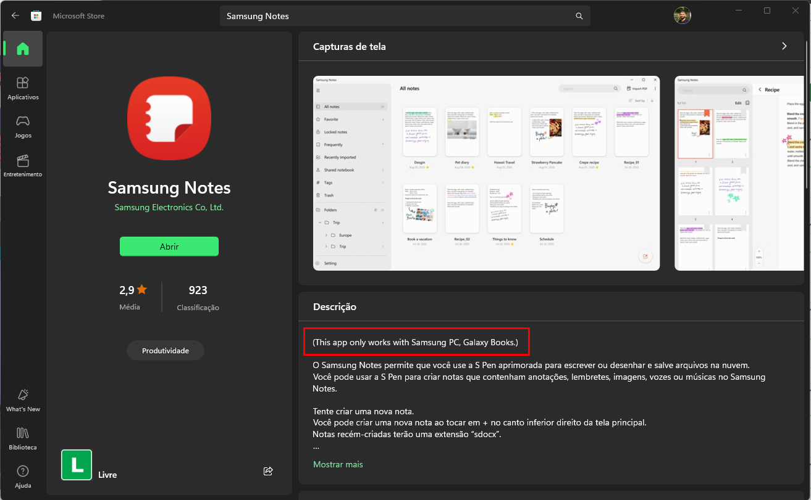

# Unlock Samsung Notes To Any Windows PC

## Description

The "unlock_samsung_notes" file is a bat script that allows you to install Samsung Notes on any Windows PC. 

## Requirements

- Windows PC
- Administrator permissions

## How to Use

1. Download the "unlock_samsung_notes" file to your Samsung device.
2. Double click on the file to run it.
3. Make sure you have administrator permissions to run the script
5. Open windows store and search for Samsung Notes. Install it.
6. If you reboot the PC and the app is not working, run the script again.

## Important Notes

- This script is provided "as is" and there is no guarantee that it will work the Samsung devices on any device or that it will work at all.
- Use this script at your own risk.

## Contribution

Contributions are welcome! If you have any improvements or fixes for this script, feel free to submit a pull request.

## License

This script is distributed under the MIT license. Refer to the LICENSE file for more information.